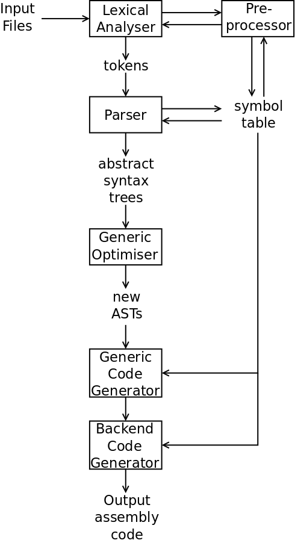

# The Basics of a Compiler

The job of a compiler is to translate input in one language (usually
a high-level language) into a different output language (usually a
lower-level language than the input). The main steps are:


 + Do [lexical analysis](https://en.wikipedia.org/wiki/Lexical_analysis)
to recognise the lexical elements. In several languages, `=` is different
to `==`, so you can't just read a single `=`. We call these lexical
elements *tokens*.
 + [Parse](https://en.wikipedia.org/wiki/Parsing) the input, i.e. recognise
the syntax and structural elements of the input and ensure that they
conform to the *grammar* of the language. For example, your language
might have this decision-making
structure:

```
      if (x < 23) {
        print("x is smaller than 23\n");
      }
```

> but in another language you might write:

```
      if (x < 23):
        print("x is smaller than 23\n")
```

> This is also the place where the compiler can detect syntax errors, like if
the semicolon was missing on the end of the first *print* statement.

 + Do [semantic analysis](https://en.wikipedia.org/wiki/Semantic_analysis_(compilers))
   of the input, i.e. understand the meaning of the input. This is actually different
   from recognising the syntax and structure. For example, in English, a
   sentence might have the form `<subject> <verb> <adjective> <object>`.
   The following two sentences have the same structure, but completely
   different meaning:

```
          David ate lovely bananas.
          Jennifer hates green tomatoes.
```

 + [Translate](https://en.wikipedia.org/wiki/Code_generation_(compiler))
   the meaning of the input into a different language. Here we
   convert the input, parts at a time, into a lower-level language.

## The Steps in SubC

SubC follows the above basic steps, but we can expand them somewhat
and add in the details of the data and data structures that it uses.



SubC is given a list of input files on the command line. It performs
lexical analysis in [src/scan.c](src/scan.c) to recognise the tokens
in the input files. At the same time, if the input files contain any
C pre-processor directives, the pre-processor in [src/prep.c](src/prep.c)
interprets these directives. Examples of these directives are to:

  + define a macro, e.g `#define FOO x+2` and to expand each use of `FOO`
    with its expansion `x+2`.
  + include a new file with the `#include "file.h"` directive by opening
    this file and passing it back to [src/scan.c](src/scan.c) to recognise
    the tokens in this file.

The lexical analyser passes a stream of *tokens* to the parser code.
The parser code in SubC reads each token from the lexical analyser
and performs both syntax analysis and some semantic analysis. This is
divided up into three sections:

  + the code in [src/stmt.c](src/stmt.c) parses *statements* in the
    C language, such as If/Else decisions, While and For loops.
  + the code in [src/decl.c](src/decl.c) parses *declarations* of
    functions, variables and pre-processor macros. These definitions
    are stored in the symbol table managed by [src/sym.c](src/sym.c).
  + the code in [src/expr.c](src/expr.c) parses *expressions* (e.g.
    operands such as constants and variables like `i`, and operators
    such as `+`, `=` and `*` dereferencing).

For each expression that [src/expr.c](src/expr.c) parses, it creates
an [abstract syntax tree](https://en.wikipedia.org/wiki/Abstract_syntax_tree)
(AST) that represents the expression. The code in [src/tree.c](src/tree.c)
manages the actions that can be performed on each AST.

We now move on to the rest of the semantic analysis where the code's
meaning is converted into another form. SubC invokes a simple code optimiser
in [src/opt.c](src/opt.c) which takes each AST and produces a more efficient
version of the tree.

Each AST is then passed to the generic code generator in [src/gen.c](src/gen.c).
This has a model of a generic accumulator-based computer, and translates
each tree into generic code which can execute on this generic computer.

Finally, this generic executable code is passed to the back-end code
generator in [src/cg.c](src/cg.c). SubC has a number of CPU back-ends:

  + 8-, 32- and 64-bit Intel CPUs: 8086, 80386 and x86-64
  + ARMv6

as well as several software platforms:

  + Linux, OS X, FreeBSD, NetBSD, BSD and Windows

I will be looking at the x86-64 code generator in [src/cg.c](src/cg.c).

And, for completeness, there are support functions in
[src/error.c](src/error.c) and [src/misc.c](src/misc.c), and the whole
compilation process is controlled by the code in [src/main.c](src/main.c).

Now that you have an appreciation of the overall structure of SubC, let's
move on to the first step, that of [lexical analysis](2_Lexical_Analysis.md).
