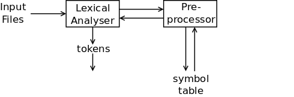

# The C Pre-Processor

As its name implies, the C pre-processor takes C source code and
pre-processes it before it is passed to the compiler proper. Here are
some of the things that it can do.

A macro can be defined, and its definition will later be used instead
of the original macro name, e.g.

```
#define ASCII_BITMASK 0x7f

        ...
  // Ensure ch is a 7-bit ASCII character
  ch = ch & ASCII_BITMASK;

  // A macro can also be undefined
#undef ASCII_BITMASK
```

C code can be compiled or ignored based on the existence of a defined macro,
e.g.

```
#define DEBUG

        ...

#ifdef DEBUG
        // This code would be compiled because DEBUG is defined
#else
        // This code would not be compiled because DEBUG is defined
#endif
```

Code from another file can be included. This redirects the compiler
to reading from the named file. When that file's contents are read,
the compiler resumes reading from the original file, e.g.

```
#include <limits.h>             // A system-wide file, usually in /usr/include
#include "defs.h"
#include "data.h"               // Local files residing in the current dir
#include "decl.h"
        ...
```

When the pre-processor reads lines from other files, it can decorate
these lines with its own pre-processor directives, e.g.

```
# 50 "defs.h"
enum {
 TVARIABLE = 1,
        ...
```

indicates that the `enum` line is line 50 in the `defs.h` file.

## The C Pre-Processor in SubC

Unlike other C compilers which implement the pre-processor as a
separate program, the pre-processor is built into SubC as part
of the lexical analysis stage. The bulk of the pre-processor code
is in [src/prep.c](src/prep.c), but it works with [src/scan.c](src/scan.c)
to be an integral part of the lexical analysis.

Let's go back to `skip()` to see how the pre-processor gets hooked into
the lexical analysis. Remember that `skip()` is supposed to ignore
unwanted input such as whitespace and newlines. But it also does this:

```
                // Deal with preprocessor directives
                // if we have a '#' after a newline
                if (nl && c == '#') {
                        preproc();
                        c = next();
                        continue;
                }
```

A '#' character after a newline signals a pre-processor directive which
calls `preproc()` which is in [src/prep.c](src/prep.c). Now it gets
interesting.

The first thing that `preproc()` does is to put the '#' character
back into the input stream and then call the lexical scanner.

```
void preproc(void) {
        putback('#');                    // Put the '#' back so the scanner
        Token = scanraw();               // can use it. Disable macro expansion
```

This will find the '#' character, then call `keyword()`:

```
                case '#':
                        Text[0] = '#';
                        scanident(next(), &Text[1], TEXTLEN-1);
                        if ((t = keyword(Text)) != 0)
                                return t;
                        error("unknown preprocessor command: %s", Text);
                        return IDENT;
```

`keyword()` does its usual `strcmp()` to find the known directives
and it returns the matching token:

```
static int keyword(char *s) {
        switch (*s) {
        case '#':
                switch (s[1]) {
                case 'd':
                        if (!strcmp(s, "#define")) return P_DEFINE;
                        break;
                case 'e':
                        if (!strcmp(s, "#else")) return P_ELSE;
                        if (!strcmp(s, "#endif")) return P_ENDIF;
                        if (!strcmp(s, "#error")) return P_ERROR;
                        break;
                case 'i':
                        if (!strcmp(s, "#ifdef")) return P_IFDEF;
                        if (!strcmp(s, "#ifndef")) return P_IFNDEF;
                        if (!strcmp(s, "#include")) return P_INCLUDE;
                        break;
                case 'l':
                        if (!strcmp(s, "#line")) return P_LINE;
                        break;
                case 'p':
                        if (!strcmp(s, "#pragma")) return P_PRAGMA;
                        break;
                case 'u':
                        if (!strcmp(s, "#undef")) return P_UNDEF;
                        break;
                }
                break;
                ...
```

However, why did `preproc()` call a function called `scanraw()` and not
the usual `scanpp()`?

The answer is that we have to disable macro expansion. Imagine we have
this C code:

```
#define FRUIT apple
#define FRUIT banana
```

The `#define FRUIT apple` sets up the `FRUIT` macro which will be expanded
to be the identifier `apple`. Later on, any occurance of `FRUIT` will
be replaced with `apple`.

If we don't disable macro expansion, then when we get to the 
`#define FRUIT banana` line, then this would be expanded to:

```
#define apple banana
```

which would define a new macro `apple` instead of redefining the old `FRUIT` macro.
Therefore, there is an alternate version of `scanpp()` called `scanraw()`:

```
// Return the next token from the input
// file without expanding macros
int scanraw(void) {
        int     t, oisp;

        oisp = Isp;             // Save the old ifdef stack pointer
        Isp = 0;                // Set the ifdef stack pointer to the stack bottom
                                // XXX: why do the above?
        Expandmac = 0;          // Don't try to expand macros
        t = scan();             // Get the next input token
        Expandmac = 1;          // Re-enable macro expansion
        Isp = oisp;             // Restore the old ifdef stack pointer
        return t;               // and return the token found
}
```

As you can see, I haven't grokked this fully yet. However, you can see the `Expandmac`
variable being set to zero before we call `scan()` which itself calls `scanpp()`.
There is code in `scanpp()` to prevent a macro from being expanded when `Expandmac` is zero:

```
                default:
                        ...
                        else if (isalpha(c) || '_' == c) {
                                Value = scanident(c, Text, TEXTLEN);
                                if (Expandmac && macro(Text))
                                        break;
                                if ((t = keyword(Text)) != 0)
                                        return t;
                                return IDENT;
                        }
```

The `break` goes to the end of the `switch` statement instead of returning a keyword
or an identifier token.

## On With `preproc()`

The last time we looked at `preproc()`, it had put back the '#' character, disabled
macro expansion with `scanraw()` and received the next token. Here is what happens next:

```
        switch (Token) {                        // Otherwise deal with the known
        case P_DEFINE:  defmac(); break;        // preprocessor directives
        case P_UNDEF:   undef(); break;
        case P_INCLUDE: include(); break;
        case P_IFDEF:   ifdef(1); break;
        case P_IFNDEF:  ifdef(0); break;
        case P_ELSE:    p_else(); break;
        case P_ENDIF:   endif(); break;
        case P_ERROR:   pperror(); break;
        case P_LINE:    setline(); break;
        case P_PRAGMA:  junkln(); break;        // Ignore #pragma and unknown
        default:        junkln(); break;        // preprocessor directives
                        break;
        }
```

Essentially, based on the pre-processor token, we invoke a number of helper functions.
Note that the `#pragma` pre-processor directive and any unknown pre-processor directives
are silently ignored. Let's look at the helper functions one at a time.


## `defmac()`: Defining a Macro

`defmac()` deals with a pre-processor line like:

```
#define FOO 23 + 7
```

When we enter `defmac()`, the `#define` has been read in and recognised
as a P_DEFINE token. We then `scanraw()` the next token to get the identifier
that follows (i.e. FOO above). If this isn't an IDENT token, it's an error.

The identifier is copied out of `Text[]` and into a local buffer `name[]`,
so that `Text[]` can be overwritten by more tokens. This is done with
`copyname()`, a helper function in [src/misc.c](src/misc.c).

Now we need to get the definition of the macro. A helper function in
[src/prep.c](src/prep.c), `getln()` reads the rest of the line into the
local `buf[]` and we skip over any leading whitespace.

Next, we call `findmac()` on the macro name to see if its already defined.
If it is and the old definition doesn't match the new definition, then
it's an error.

Finally, if the macro doesn't exist, call `addglob()` to add the new macro
to the symbol table.

```
// Define a macro with #ifdef
static void defmac(void) {
        char    name[NAMELEN+1];
        char    buf[TEXTLEN+1], *p;
        int     y;

        // Get the next token and copy its value into name[]
        // Error if this was not an identitier
        Token = scanraw();
        if (Token != IDENT)
                error("identifier expected after '#define': %s", Text);
        copyname(name, Text);

        // Get the rest of the line into the buf[]
        // Skip any leading whitespace
        if ('\n' == Putback)
                buf[0] = 0;
        else
                getln(buf, TEXTLEN-1);
        for (p = buf; isspace(*p); p++)
                ;

        // Error if the macro was already defined.
        // Otherwise use addglob() to add this as a global macro
        if ((y = findmac(name)) != 0) {
                if (strcmp(Mtext[y], buf))
                        error("macro redefinition: %s", name);
        }
        else {
                addglob(name, 0, TMACRO, 0, 0, 0, globname(p), 0);
        }
        Line++;
}
```

## Adding and Finding a Macro

The two functions `findmac()` and `addglob()` are part of the symbol
table management code in [src/sym.c](src/sym.c). I don't want to cover
these functions here, but let's talk about how they are used by the above code.

Each symbol in SubC comes with a number of attributes which I'll cover later.
For pre-processor macros, we have to capture:

 + the symbol type, TMACRO,
 + the macro's name, in `name[]` in the above code, and
 + the macro's definition, pointed to by `p` in the above code

`addglob()` is used to add all symbols to the symbol table. This is why,
in the code above, many of the possible attributes that could be set are
set to zero.

There is one final thing to mention: the call to `globname()`. SubC is
written so that it never allocates memory dynamically with functions like
`malloc()`, `calloc()`, `strdup()` or `sbrk()`. So `globname()` allocates
memory in a large character array and copies the macro's definition into
this table. Here, `globname()` could be replaced by `strdup()`.

Once a macro is in the symbol table, we can search for it with `findmac`.
The code simply walks across the global section of the symbol table
looking for a TMACRO symbol whose name matches the argument to the function:

```
// Determine if the symbol s is a global macro in the symbol table.
// Return its slot position or 0 if not found.
int findmac(char *s) {
        int     i;

        for (i=0; i<Globs; i++)
                if (    TMACRO == Types[i] &&
                        *s == *Names[i] && !strcmp(s, Names[i])
                )
                        return i;
        return 0;
}
```

## `undef()`: Undefining a Macro

The `undef()` function is very similar to `defmac()`
in that it scans in the following token and checks that this is an identifier.
The code then calls `findmac()` to find the existing macro definition,
and changes the macro's name to "#undef'd" to remove the macro's name.

```
// Deal with an #undef directive
static void undef(void) {
        char    name[NAMELEN+1];
        int     y;

        // Get the next token and copy its
        // value into name[]
        Token = scanraw();
        copyname(name, Text);

        // Error if not an identifier. Otherwise,
        // search for the macro. If found, set it to "#undef'd"
        if (IDENT != Token)
                error("identifier expected after '#undef': %s", Text);
        if ((y = findmac(name)) != 0)
                Names[y] = "#undef'd";
}
```

## `include()`: Including a New File

Including a file is a complicated task. We have to pause the processing
of the current file, open up the new file, process that one, close it
down and go back to processing the old file. And `#include`d files can
also `#include` files themselves, so we need to do this recursively.

One way to do this would be to have a stack of file processing states,
and to push a new file processing state each time we open a new input
file. SubC takes a different approach: once the new file is open,
`include()` makes a call to `top()` (which we haven't covered yet).
This starts a whole new lexical analysis loop. Thus `include()` may
eventually call itself recursively, and the local variables in `include()`
*are* the stack of file processing states.

The code in `include()` is long so I won't include it here, but here
are the main actions:

 + Skip whitespace after the `#include` and get the first character
   after this, which should be either '<' or '"'.
 + Read the rest of the line into the `file[]` character array.
 + Report an error if the `file[]` was empty didn't end in a '>' or '"'.
 + If the first character was a '<', then prepend the SCCDIR to the
   file's name. This is the system-wide include directory, normally
   `/usr/include`. 
 + Open up the file or report an error.
 + Stash the current file processing state in these variables:
   `oc`, `oline`, `ofile` and `oinfile`.
 + Reset the line counter to 1 and get the first token from the new file.
 + Loop scanning tokens from the new file until the XEOF (end of file)
   token is reached.
 + Unstash the old file processing state and close the new file down.

## Dealing with `#ifdef`, `#else` and `#endif`

One of the interesting features of the C pre-processor is the ability
to selectively include or ignore code in the input based on the existence
(or lack) of a defined macro:

```
#ifdef FOO
	// Include this code
#else
	// Ignore this code
#endif
```

It is also possible to have nested `#ifdef` ... `#else` ... `#endif`.

SubC deals with this by having a stack which record the knowledge of
the state of the current (most nested) and previous (outer) `#ifdef`s:

```
#define MAXIFDEF  16
extern_ int	  Ifdefstk[MAXIFDEF], Isp;
```

Each element in the stack is the token P_IFDEF, P_IFNDEF, P_ELSE or
a special non-existent token P_ELSENOT. The `Isp` variable points to
the next empty position on the `Ifdefstk[]`.

Now, when should the tokens that we are reading from the input be
passed to the parser? Only when the `Ifdefstk[]` stack is empty
or when the top of the `Ifdefstk[]` is marked as P_IFDEF, i.e. the
most recent `#ifdef` matched a defined macro.

In [src/prep.c](src/prep.c), the function `frozen()` returns true
if we *cannot* accept and pass tokens to the parser, i.e. when
the most recent `#ifdef` failed, or we are in the `#else` section of
a successful `#ifdef`:

```
// Return true if the "depth" element on the
// ifdef stack is a frozen context. A frozen
// context is one which can be ignored, e.g.
// a preprocessor directive in an #ifdef
// section when the #ifdef was false.
int frozen(int depth) {
        return Isp >= depth &&
                (P_IFNDEF == Ifdefstk[Isp-depth] ||
                P_ELSENOT == Ifdefstk[Isp-depth]);
}
```

Here's what happens. Assume an `#ifndef` was successful, so the following
code should be "frozen". A P_IFNDEF is pushed on the `Ifdefstk[]`. When
we hit any `#else`, this is changed to a P_ELSE which allows the code to
be parsed.

Similarly, when an `#ifdef` was successful, a P_IFDEF is pushed on the
`Ifdefstk[]` and the following code is not frozen. Then on the `#else`,
the P_IFDEF is changed to the non-existent token P_ELSENOT to mark
the code afterwards as frozen:

```
// Return true if the "depth" element on the
// ifdef stack is a frozen context. A frozen
// context is one which can be ignored, e.g.
// a preprocessor directive in an #ifdef
// section when the #ifdef was false.
int frozen(int depth) {
        return Isp >= depth &&
                (P_IFNDEF == Ifdefstk[Isp-depth] ||
                P_ELSENOT == Ifdefstk[Isp-depth]);
}
```

So where does the `frozen()` test get used? Back in the
[src/scan.c](src/scan.c) scanner, the function `scan()` comes above
`scanpp()` and only lets tokens from non-frozen code sections through:

```
int scan(void) {
        int     t;

        do {
                t = scanpp();
                                // Error if we hit the end of a file
                                // and we were in an #include'd file
                                // with a non-empty #ifdef stack
                                // as we never saw the matching #endif
                if (!Inclev && Isp && XEOF == t)
                        fatal("missing '#endif'");
        } while (frozen(1));
        if (t == Syntoken)
                Syntoken = 0;
        return t;
}
```

The `do ... while (frozen(1));` loop reads and discards the frozen tokens.
There is also a test for an end of file when we had previously `#include`d
a file: this means that the matching `#endif` is missing.

Finally, the `Syntoken` variable can be set to a "synchronisation" token.
If an syntax error is detected by the parser, it can set `Syntoken` to
something like a semicolon, token SEMI. The parser can then ignore
tokens until it hits the `Syntoken`. This allows the parser to "get
back into sync". If we didn't do this, one syntax error would spawn
many more syntax errors!

## `ifdef()`: Should the Code be Frozen?

`ifdef()` gets called when an `#ifdef` is scanned. It is called with a *1*
if the macro should exist, or *0* if the macro should not exist. The
function:

 + sends an error if there ae too many nested `#ifdef`s
 + reads in the macro's name into `name[]` and ensures it was an identifier
 
Now the important code:

```
        // Put P_IFDEF on the ifdef stack if we are not in a frozen
        // context and the name[] macros evaluates to true. Otherwise
        // put P_IFNDEF on the ifdef stack to mark the context frozen.
        if (frozen(1))
                Ifdefstk[Isp++] = P_IFNDEF;
        else if ((findmac(name) != 0) == expect)
                Ifdefstk[Isp++] = P_IFDEF;
        else
                Ifdefstk[Isp++] = P_IFNDEF;
```

So P_IFDEF goes on the stack if we can use the following code, or P_IFNDEF
to freeze the following code section.

## `p_else()`: Flip The Status on the Stack

`p_else()`s job is to invert the most recent `Ifdefstk[]` status. As mentioned,
there is a non-existent token P_ELSENOT to flip a P_IFDEF:

```
// Deal with an #else directive
static void p_else(void) {

        // Error if no matching #ifdef
        if (!Isp)
                error("'#else' without matching '#ifdef'", NULL);

        // Do nothing if we're in a frozen context
        else if (frozen(2))
                ;

        // We have to already have a P_IFDEF or a P_IFNDEF
        // on the ifdef stack, otherwise there's no matching #ifdef.
        // Reverse the meaning of the value on the ifdef stack.
        // Use the special P_ELSENOT value, so we see a following #else
        // as an error and don't "double negative" it.
        else if (P_IFDEF == Ifdefstk[Isp-1])
                Ifdefstk[Isp-1] = P_ELSENOT;
        else if (P_IFNDEF == Ifdefstk[Isp-1])
                Ifdefstk[Isp-1] = P_ELSE;
        else
                error("'#else' without matching '#ifdef'", NULL);
                
}
```

## `p_endif()`: Pop the `Ifdefstk[]`

Nice and easy code here:

```
// Deal with an #endif. Give error if no matching #define.
// Otherwise pop a value from the ifdef stack.
static void endif(void) {
        if (!Isp)
                error("'#endif' without matching '#ifdef'", NULL);
        else
                Isp--;
}
```

## Miscellaneous Directives

We have left a few miscellaneous pre-processor directives to deal with:
`#error` which reports a pre-processor error and `#line` which indicates
the line number of an included file. Given that SubC doesn't generate these
itself, I'm assuming that these are here in case SubC has to read in a C
file which has already been pre-processed. The code is simple, so I won't
include it here.

## Conclusion

We've reached the end of the lexical analysis stage of SubC:



The code of the lexical analysis is done in `scanpp()` which recognises
simple tokens, and calls out to other functions to scan the more complicated
tokens. If a pre-processor directive is found, `preproc()` gets called to
deal with this. This may result in a macro being added to the symbol table.

Sections of code may be "frozen" (ignored) depending on the existence
of a token and an `#ifdef`, `#else` or `#ifndef` directive. Therefore,
the parser calls `scan()` and not `scanpp()` directly so that the frozen
input code gets skipped.

The pre-processor itself requires use of the scanner to read in the names
of the macros and any macro definition. We need to prevent macro expansion
when this occurs, so the pre-processor calls `scanraw()` to make this happen.

We can now move on to the syntax parsing phase of the SubC compiler.
