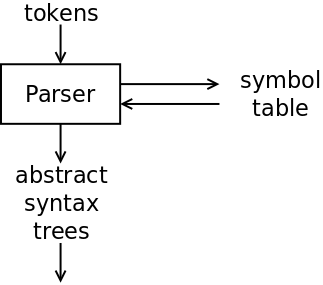

# Statement Parsing in SubC

It's time to turn our attention to the parsing (syntax analysis) of
the input tokens from the scanner. SubC breaks this down into three
sections:

  + Statement parsing in [src/stmt.c](src/stmt.c)
  + Declaration parsing in [src/decl.c](src/decl.c)
  + Expression parsing in [src/expr.c](src/expr.c)



The parser interacts with the symbol table to do things like create and
retrieve the types of variables and function parameters. Not only does
the parser do syntax analysis, e.g. to identify this as incorrect:

```
	{ if (2+3] { print(("Hell"o}; ++ ]))
```

but it also does semantic analysis to detect errors like type mismatches, e.g.

```
	int x[];
	int y;
	y= x+23;
```

The parser has the job of calling the code generator to output the assembly
code. Some of this can be done directly; some of this is done by constructing
[abstract syntax trees](https://en.wikipedia.org/wiki/Abstract_syntax_tree)
(ASTs) which are then optimised and flattened by the generic code generator.

## The C Grammar and BNF Notation

Each language has a *grammar*: the set of acceptable statements in that language,
and how that language is structured. In computing languages, this is often
expressed in [Backus-Naur Form](https://en.wikipedia.org/wiki/Backus%E2%80%93Naur_form).
In the comments for the files [src/stmt.c](src/stmt.c), [src/decl.c](src/decl.c) and
[src/expr.c](src/expr.c), SubC outlines the grammar of the subset of C that it recognises
in BNF format.

Here's the first fragment of the grammar from the top of [src/stmt.c](src/stmt.c)

```
   compound :=
          { stmt_list }
        | { }
  
   stmt_list:
          stmt
        | stmt stmt_list
```

A *compound statement* is a *list of statements* surrounded by curly brackets, or
it is a pair of curly brackets with nothing on the inside. At this point I should
touch on the concept of
[terminal and non-terminal symbols](https://en.wikipedia.org/wiki/Terminal_and_nonterminal_symbols).

A *terminal* symbol is a symbol in a grammar that cannot be broken into other symbols: they
are irreducible. In SubC, the tokens that were recognised by the scanner are the terminal
symbols, because they cannot be subdivided.

On the other hand, a *non-terminal* symbol is a symbol which can be broken into other
symbols. There is a *production rule* in the grammar which describes how a *non-terminal* can
be *produced* (broken up) into other symbols.

So, for the *compound* non-terminal, the rule is:

```
   compound :=
          { stmt_list }
        | { }
```

where the curly brackets are the terminal symbols and *stmt_list* is another non-terminal.
How do we know that *stmt_list* is a non-terminal symbol? Because it has its own
production rule:

```
   stmt_list:
          stmt
        | stmt stmt_list
```

A statement list is either a single statement, or a statement followed by another
statement list. Notice that this rule is *recursive*: one of the alternatives in the
rule has its own non-terminal.

Now, we can replace *stmt_list* by a single *stmt* (alternative #1). Therefore, the
second alternative allows *stmt_list* to be two *stmt*s in a row: the first *stmt*
is given, and we know that the *stmt_list* can be replaced with a single *stmt*.

Given this, it should be obvious that a *stmt_list* could also be three *stmt*s in a row:

```
    stmt_list => stmt stmt_list
    stmt_list => stmt stmt stmt_list
    stmt_list => stmt stmt stmt
```

Inductively, the original BNF rule for *stmt_list* allows it to be one or more *stmt*s.
This is the power of the BNF notation: it's compact but it permits a very sophisticated
grammar to be described.

## Recursive Descent Parsing

SubC implements the recognition of the C grammar with a
[recursive descent parser](https://en.wikipedia.org/wiki/Recursive_descent_parser).
Following the recursive nature of the BNF rules, each function in the parser can
call other functions, which can themselves call each other including the original
function.

Each function has the job of recognising one of the non-terminals in the
grammar. To do this, it reads one or more tokens from the input stream. Based on this
token, it uses the BNF definition to determine which alternative it should follow
and goes down that path. Sometimes that path fails, so the parser might have to
back up (i.e. push back a token) to follow a different path. If the tokens do not
match any of the paths in the BNF rules, the parser declares a *syntax error*.

That's enough of the theory of parsing, but I've only touched the surface. At this
point, I highly recommend that you go get Nils' book about SubC,
[Practical Compiler Construction](http://www.t3x.org/reload/index.html), as it
covers the theory in more detail.

## Statement Parsing: Where and How to Start?

We will start our tour of the SubC parser with statement parsing. The
top-level statement parsing function is `stmt()` which is in
[src/stmt.c](src/stmt.c). The first thing we need to determine is
how we get to the point where the code in `stmt()` is running.

The SubC compiler starts in `main()` (in [src/main.c](src/main.c))
which interprets the flags and file arguments on the command line.

Every non-flag argument is passed to the `compile()` function:

```
        for (i=1; i<argc; i++) {
                if (*argv[i] != '-') break;
                if (!strcmp(argv[i], "-")) {
                        compile(NULL, def);
                        exit(Errors? EXIT_FAILURE: EXIT_SUCCESS);
                }
```

After opening the correct files, `compile()`
(also in [src/main.c](src/main.c)) then passes control to `program()`:

```
static void compile(char *file, char *def) {
	...
        program(file, in, out, def);
```

`program()` (in [src/decl.c](src/decl.c)) generates the assembly prelude
code, scans the first token and calls the `top()` function:

```
// Parse the specified file and generate assembly output
void program(char *name, FILE *in, FILE *out, char *def) {

        init();                         // Initialise all variables
        defarg(def);                    // Define any -D from the cmd line
        Infile = in;                    // Set the current in/out FILE pointers
        Outfile = out;
        File = Basefile = name;         // Set the input file's name
        genprelude();                   // Generate the assembly prelude
        Token = scan();                 // Get the first token from the input
        while (XEOF != Token)           // Until we hit the end of the file
                top();
        genpostlude();                  // Generate the assembly postlude
                                        // Optionally, dump symbols and stats
        if (O_debug & D_GSYM) dumpsyms("GLOBALS", "", 1, Globs);
        if (O_debug & D_STAT) stats();
}
```

The `top()` function (also in [src/decl.c](src/decl.c)) parses the various
declarations that can occur at the top of a C program. Eventually it
finds a function declaration followed by a compound statement, i.e.
a pair of '{' ... '}' with zero or more statements inside.

`compound()` (in [src/stmt.c](src/stmt.c)) gets the token after '{'
and repetetively calls `stmt()` until we hit the closing '}':

```
void compound(int lbr) {
        if (lbr) Token = scan();        // Get next token if still on the '{'
        while (RBRACE != Token) {       // Until we get the '}'
                if (eofcheck()) return; // Return on EOF
                stmt();                 // Parse the statement within
        }
        Token = scan();                 // And get the token after the '}'
}
```

And so, we finally hit the `stmt()` function!

## `stmt()`: Recognising the Main C Statements

`stmt()` implements this BNF rule:

```
   stmt :=
          break_stmt
        | continue_stmt
        | do_stmt
        | for_stmt
        | if_stmt
        | return_stmt
        | switch_stmt
        | while_stmt
        | compound
        | ;
        | expr ;
```

where ';' is a terminal and all the other symbols are non-terminals. In other words,
it recognises all the main statements in the C language. Of course, this is too much
for one function to perform, so `stmt()` just looks at the current token and uses this
to determine which alternative to follow. It calls other functions to parse these alternatives:

```
static void stmt(void) {
        int     lv[LV];

        switch (Token) {
        case BREAK:     break_stmt();    break;
        case CONTINUE:  continue_stmt(); break;
        case DO:        do_stmt();       break;
        case FOR:       for_stmt();      break;
        case IF:        if_stmt();       break;
        case RETURN:    return_stmt();   break;
        case SWITCH:    switch_stmt();   break;
        case WHILE:     while_stmt();    break;
        case LBRACE:    compound(1);     break;
        case SEMI:      Token = scan();  break;

        // Can't have 'default' or 'case' outside a 'switch' statement
        case DEFAULT:   wrong_ctx(DEFAULT); break;
        case CASE:      wrong_ctx(CASE); break;

        // Not a statement, try parsing it as an expression followed
        // by a semicolon. Flush the insruction queue.
        default:        expr(lv, 0); semi(); commit(); break;
        }
        clear(1);       // Primary register is now empty
}
```

Note some syntax error reporting: we can't have a `default` or `case` keyword because
we are not in a `switch` statement at this point in time.

There are functions which are involved in the generation of the output assembly code:
`commit()` and `clear()`. I'll delay discussion of those for now, but I'll come back
to them soon.

Let's choose to look at compound statements next.

## `compound()`: Compound Statements

We've already seen the BNF rules for compound statements:

```
   compound :=
          { stmt_list }
        | { }
  
   stmt_list:
          stmt
        | stmt stmt_list
```

We must look for a '{', then zero or more statements, then a '}'. This is done with
a loop that parses statements until the '}' token is received:

```
void compound(int lbr) {
        if (lbr) Token = scan();        // Get next token if still on the '{'
        while (RBRACE != Token) {       // Until we get the '}'
                if (eofcheck()) return; // Return on EOF
                stmt();                 // Parse the statement within
        }
        Token = scan();                 // And get the token after the '}'
}
```

## `do_stmt()`: Do ... While Loops

Here's the BNF rule for Do ... While loops:

```
   do_stmt := DO stmt WHILE ( expr ) ;
```

`stmt` and `expr` are non-terminals, and we will call functions to deal with them.
The rest are terminals, i.e. tokens, and we can read them in from the scanner here.
Here is the code for `do_stmt()`:

```
static void do_stmt(void) {
        int     ls, lb, lc;

        Token = scan();                 // Skip the 'do' token
        ls = label();                   // Get a label for the top of loop
        pushbrk(lb = label());          // Get labels for breaks and continues
        pushcont(lc = label());         // & push them on the respective stack
        genlab(ls);                     // Generate the top label
        stmt();                         // Parse the statement
        match(WHILE, "'while'");        // Get the 'while' token
        lparen();                       // Get the '(' token
        genlab(lc);                     // Generate the continue label
        rexpr();                        // Parse the expression
        genbrtrue(ls);                  // Generate "branch if true to top"
        clear(1);                       // Primary register is now empty
        genlab(lb);                     // Generate the break label
        rparen();                       // Get the ')' and ';' tokens
        semi();
        Bsp--;                          // And pop the break and continue
        Csp--;                          // labels from their stacks
}
```

You should be able to spot the code that reads and checks the tokens: `scan()`,
`match()`, `lparen()`, `rparen()`, `semi()`. You should also be able to spot the
calls to the functions that deal with the non-terminals: `stmt()` and `rexpr()`.
So now let's look at the rest of the code.

We have to translate C code that looks like this:

```
   do {
      // Zero or more statements inside the loop
   } while (this expression is true);
```

into assembly code. We need the ability to return to the top of the set of statements
if the loop expression is true, or keep going onwards if not.

Even more interesting, C has the `break` and `continue` keywords. If we see a `break`,
we must immediately leave the loop, skipping all the statements and the loop test.
If we see a `continue`, we must immediately run the loop's expression; if it's true,
we can execute another loop iteration. If not, we leave the loop.

This is translated into assembly with three labels, the testing of the loop expression
and a jump based on the test's result:

```
    start_label:
	// All the assembly code for the
	// statements inside the loop
	
    continue_label:
	test the loop expression
	jump to the start_label if the test is true
    break_label:
```

Any `break` inside the loop will be translated into an immediate jump to the `break_label`,
and any `continue` inside the loop will be translated into an immediate jump to the
`continue_label`. The loop's expression is evaluated at the bottom and jumps to the
`start_label` if true.

With that explained, we can return to the analysis of the `do_stmt() code, but with one
more sidetrack. C allows loops inside loops, so there can be nested labels, e.g.

```
    lvl1_continue_label:
	...
    	lvl2_continue_label:
	...
    	lvl2_break_label:
	...
    lvl1_break_label:
```

We thus need a stack to hold the `break` and `continue` labels for our loops, so that
any specific `break` command can be translated to the correct label for its loop.

Returning to the `do_stmt()` code, we can see that three assembly labels are generated:
`ls`, `lb` and `lc` for the `start_label`, `break_label` and `continue_label`. Two of
them are pushed onto stacks.

The `start_label` is output, followed by the assembly for all the statements inside
the loop. The `while` and '(' tokens are parsed. Now the `continue_label` is output.
The assembly code for the expression is output by `expr()`. The "branch if true"
assembly to the `start_label` is output by `genbrtrue()`. Now the `break_label` is
output along with the parsing of the ')' and ';' tokens. Finally, the two labels
are popped from their stacks as they are no longer needed.

Finally, a quick word about the call to `clear(1)`. SubC's generic gode generator
models a hypothetical CPU with a main register called an *accumulator*. There is only
one accumulator; if it is needed while it is occupied, the accumulator must be
[spilled](https://www.webster-dictionary.org/definition/register%20spilling) to
free it for another use.

The `rexpr()` call calculated the value of the loop's expression and left this value in
the accumulator. The `genbrtrue()` call generated the code that used this value, but
it left the accumulator "occupied". So, the call to `clear()` marks that the accumulator
is free again for other assembly code to use it.

